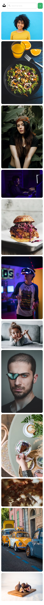

<h1 align="center">Unsplash Clone</h1>

<div align="center">
   Solution for a challenge from  <a href="http://devchallenges.io" target="_blank">Devchallenges.io</a>.
</div>

<div align="center">
  <h3>
    <a href="https://focused-bassi-b35684.netlify.app/">
      Demo
    </a>
    <span> | </span>
    <a href="https://devchallenges.io/solutions/IgKv4WRie4HqpVSqmxA6">
      Solution
    </a>
    <span> | </span>
    <a href="https://devchallenges.io/challenges/rYyhwJAxMfES5jNQ9YsP">
      Challenge
    </a>
  </h3>
</div>

<!-- TABLE OF CONTENTS -->

## Table of Contents

- [Overview](#overview)
  - [Built With](#built-with)
- [Features](#features)
- [How to use](#how-to-use)
- [Contact](#contact)

<!-- OVERVIEW -->

## Overview
A clone web application of unsplash.

### Desktop


### Mobile



### Built With

- HTML
- Sass/CSS
- [Node.js](https://nodejs.org/en/) - Runtime environment for executing javascript server-side
- [React.js](https://reactjs.org/) - Javascript library for building user interfaces
- [Express.js](https://expressjs.com/) - Node.js Web framework
- [Mongoose](https://mongoosejs.com/) - MongoDB object modeling for Node.js

## Features

As a user,
- User can see a list of photos in the masonry layout that was added
- User can add a new photo to the list - the new photo would be on top of the list
- User can search for photos by label
- When the user hovers a photo, the user can see a label and a delete button
- User can select an image
- User can zoom in and zoom out on selected image
- User can download selected image
- User can delete images
- When a user deletes an image, the user can enter the password

## How To Use

To clone and run this application, you'll need [Git](https://git-scm.com) and [Node.js](https://nodejs.org/en/download/) (which comes with [npm](http://npmjs.com)) installed on your computer. From your command line:

```bash
# Clone this repository
$ git clone https://github.com/Josh-Ay/my-unsplash-clone

# Install dependencies
$ npm install

# Run the app
$ npm start
```

## Contact

- GitHub [@Josh-Ay](https://{github.com/Josh-Ay})
